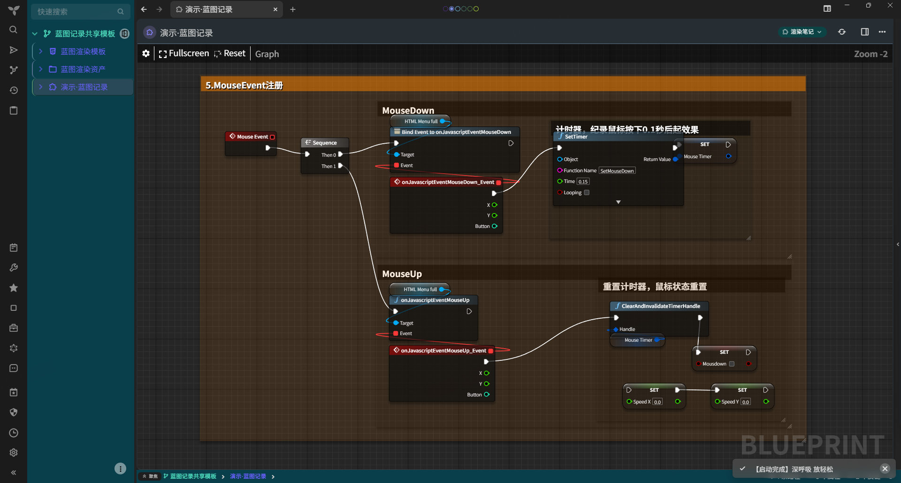

# Trilium_UEGraph

为 [TriliumNext/Trilium](https://github.com/TriliumNext/Trilium) 开发的共享模板（插件形态），用于把 **UE 蓝图节点图** 记录到 Trilium、并以可视化方式展示。

在 UE 编辑器里选中节点 → 右键 **复制(Copy)**，把得到的 **T3D 文本** 当作一份代码笔记保存。Trilium 中的渲染笔记会通过本模板自动绘制出对应的节点图。

## 截图

直接预览粘贴结果：



此状态下，可以拖拽，但刷新后所有编辑不保存

<video controls src="file/edit_compressed.mp4" title="编辑蓝图"></video>

使用笔记嵌入功能，在文本笔记中插入要记录的蓝图：


> 在插入状态下，支持缩放，但不支持拖拽；有时会显示不全，可以通过 Ctrl + R 进行刷新

## 特性

- **即贴即画**：把 UE 复制的节点文本粘贴到 code 子笔记，保存后自动渲染成节点图。
- **纯滚轮缩放**：画布支持滚轮缩放与拖拽平移，无多余工具栏，铺满全页。
- **完全自包含**：渲染引擎已内置在仓库的 `蓝图渲染资产` 中，导入即可用，无需外部服务。

## 安装方法

1. **获取发布**：从 reless 中获取压缩包
2. **导入插件**：在想要导入的位置右键，选择导入
   - 需要**取消安全导入**，以使脚本生效
3. 如有必要，在设置中允许后端脚本运行

> 或者自行查看仓库源码导入

## 使用

任何一张「蓝图记录」都是：

```
某蓝图（render 笔记，类型 render）
 ├─ ~renderNote  关系 → 蓝图渲染模板
 └─ 蓝图文本（code 子笔记，mime text/plain）  ← 存 UE 复制的 T3D 文本
```

新建步骤：

1. 以 `演示·蓝图记录` 为模板创建一个文本笔记
2. 将 `T3D` 代码粘贴到子笔记中
3. 刷新页面即可

## 目录结构

```
Trilium-UEGraph/
 ├─ README.md                 项目说明（本文件）
 ├─ !!!meta.json              Trilium 共享笔记导出元数据
 ├─ index.html / navigation.html / style.css   导出预览页
 ├─ file/image.png            截图
 └─ 蓝图记录共享模板/
      ├─ 蓝图记录共享模板.html  模板书笔记（简介 / 使用说明）
      ├─ 蓝图渲染模板.html      Trilium 渲染界面骨架（全高画布，无工具栏）
      │    └─ 蓝图渲染脚本.js    胶水逻辑：定位记录、读源码、注入引擎、全高绘制
      ├─ 蓝图渲染资产.html
      │    ├─ render.js        ← blueprintUE 渲染引擎（内置，见来源与许可）
      │    └─ render.css       ← 渲染引擎样式（内置，见来源与许可）
      └─ 演示·蓝图记录/
           └─ 示例蓝图文本.txt   演示用 T3D 源码
```

## 渲染引擎来源与许可

- **render.js / render.css**：即 blueprintUE 渲染引擎，源自 [blueprintue/blueprintue-self-hosted-edition](https://github.com/blueprintue/blueprintue-self-hosted-edition) 项目的 `www/bue-render` 目录，遵循 **MIT License**（Copyright blueprintUE）。本仓库已将其内置到 `蓝图渲染资产` 笔记中
- **蓝图渲染脚本.js**：使用自定义 js 定位渲染笔记、读取源码、注入引擎、全高绘制，与上游引擎相互独立。

## 说明

- 输入必须是 UE 编辑器「复制节点」生成的 **T3D 文本**；蓝图 JSON / `.uasset` / 图片不生效。